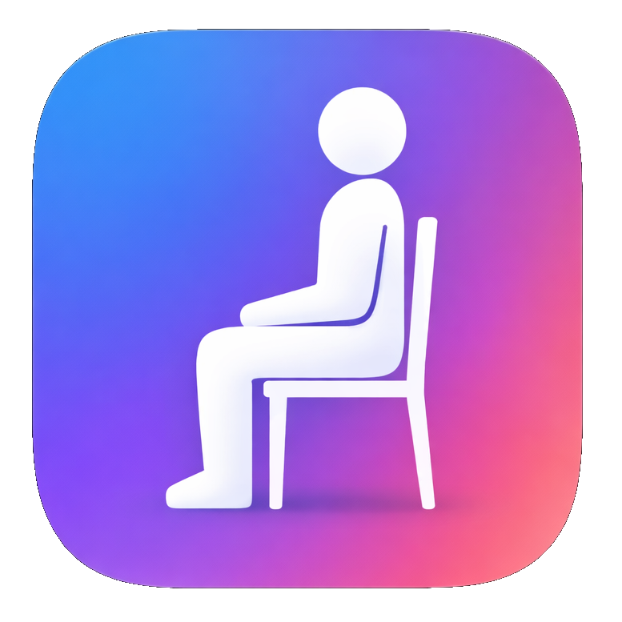

<p align="center">
  
</p>

<h1 align="center">Neck Back Saver (목허리세이버)</h1>

<p align="center">
  A tray-based Electron app that periodically pops up a posture reminder image at your cursor position. <br/>
  Sit up straight. Your spine will thank you.
</p>

---

## How It Works

1. The app lives in your system tray — no dock icon, no distractions.
2. At a configurable interval (default: 60 seconds), a reminder image **blinks 3 times** at your cursor, then stays visible until you acknowledge it.
3. Pick from the built-in sample posters or add your own custom images.
4. Localized for **English** and **Korean** (auto-detected from system locale).

## Sample Images

The app ships with 5 built-in reminder posters:

| | | | | |
|:---:|:---:|:---:|:---:|:---:|
|  |  |  |  |  |
| Time to Stretch | Correct Your Posture | 자세를 고쳐라 | Correct Your Posture | 너의 자세를 디스크가 모르게 하라 |

## Installation

### From Release

Download the latest release from the [Releases](https://github.com/k2sebeom/neck-back-saver/releases) page.

- **macOS**: `.dmg`
- **Windows**: `.exe` (portable) or NSIS installer

### From Source

```bash
# Clone the repository
git clone https://github.com/k2sebeom/neck-back-saver.git
cd neck-back-saver

# Install dependencies
yarn install

# Build and run
yarn build
yarn start

# Package for distribution
yarn package
```

## Usage

- **Right-click** the tray icon to access the menu.
- **Change interval** — adjust how often the reminder pops up.
- **Change image** — open the image picker to select a built-in poster or add your own custom image.
- **Quit** — exit the app.

## Tech Stack

- [Electron](https://www.electronjs.org/) 28
- [TypeScript](https://www.typescriptlang.org/)
- [electron-store](https://github.com/sindresorhus/electron-store) for config persistence
- [electron-builder](https://www.electron.build/) for packaging

## License

[MIT](LICENSE)
